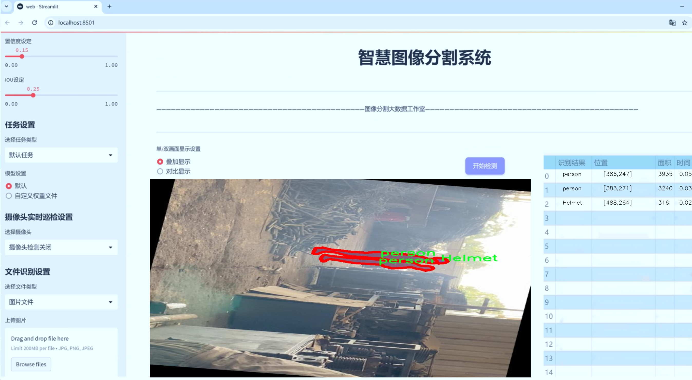
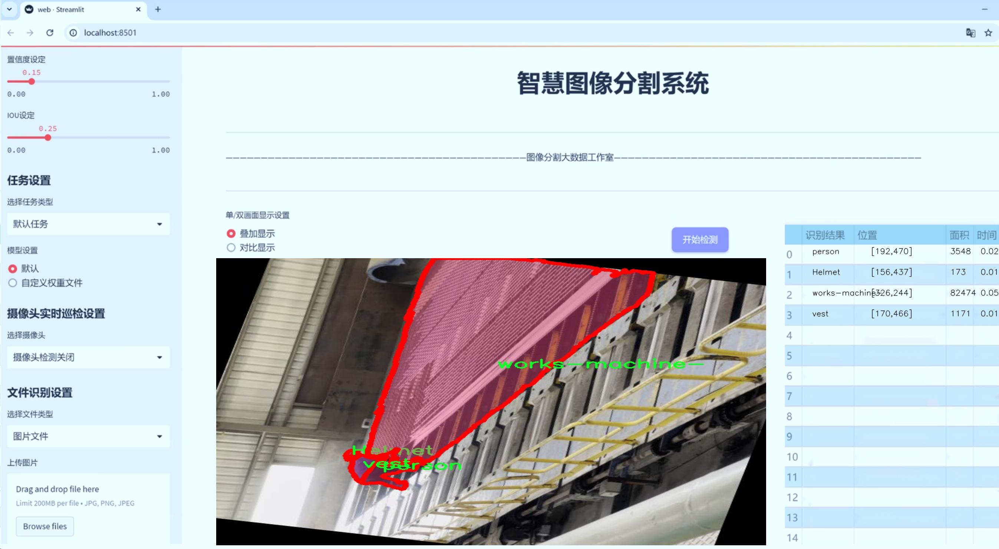
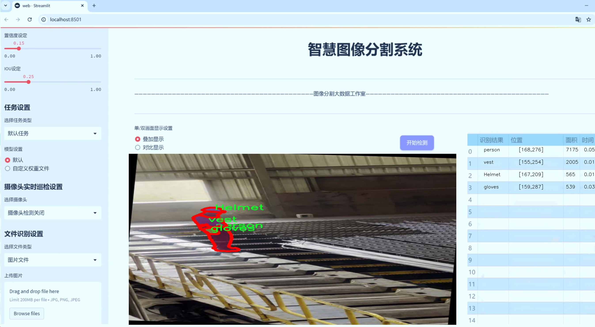
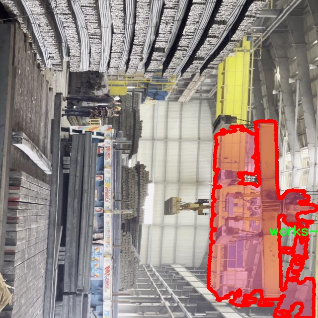
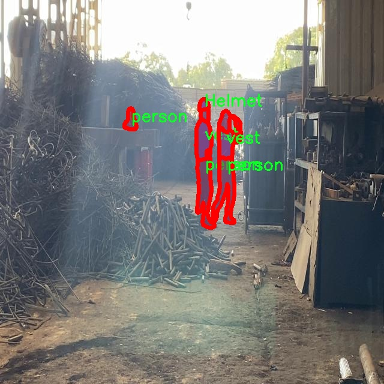
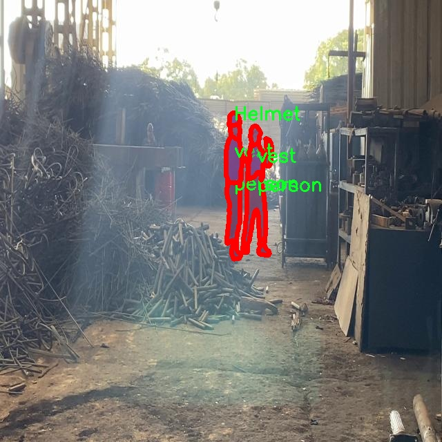
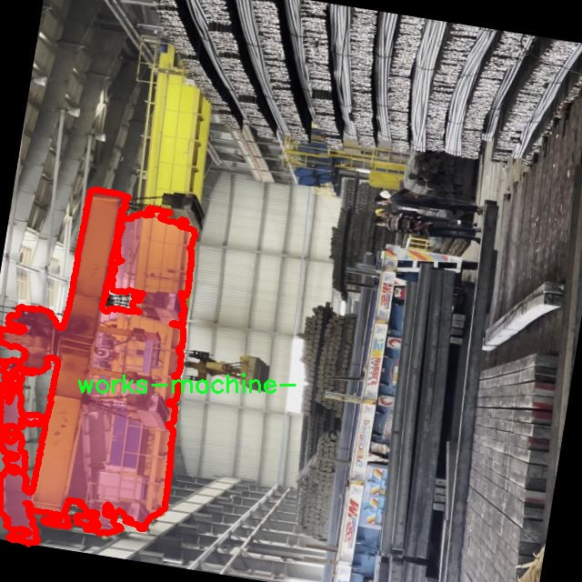
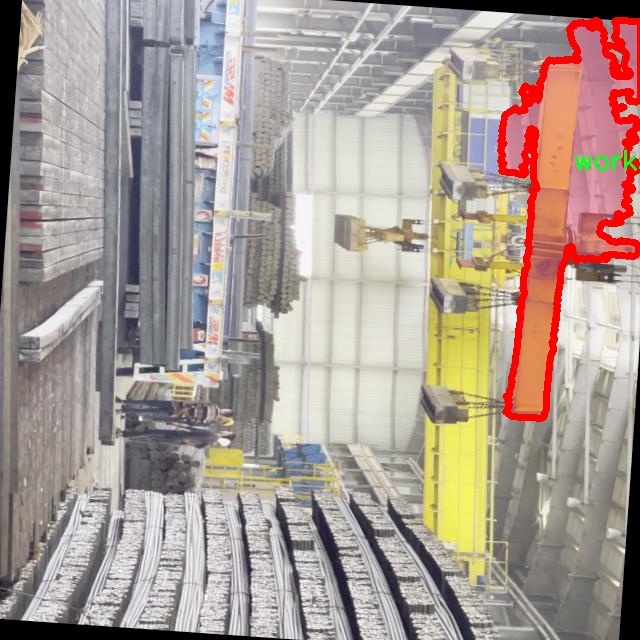

# 工厂工人操作机械工作图像分割系统： yolov8-seg-RepHGNetV2

### 1.研究背景与意义

[参考博客](https://gitee.com/YOLOv8_YOLOv11_Segmentation_Studio/projects)

[博客来源](https://kdocs.cn/l/cszuIiCKVNis)

研究背景与意义

随着工业自动化和智能制造的快速发展，工厂安全管理和生产效率的提升愈发受到重视。在这一背景下，工人操作机械的安全性和规范性成为了企业管理者和研究者关注的焦点。工人在进行机械操作时，佩戴合适的安全防护装备（如安全帽、手套、反光背心等）是确保其人身安全的重要措施。然而，工人是否正确佩戴这些防护装备，以及在工作过程中是否遵循安全操作规程，直接影响到工厂的安全生产环境。因此，开发一套高效的图像分割系统，以实时监测工人在操作机械时的安全状态，具有重要的现实意义。

近年来，深度学习技术的迅猛发展为图像处理领域带来了革命性的变化。尤其是目标检测和图像分割技术的进步，使得对复杂场景中目标的识别和分割变得更加高效和准确。YOLO（You Only Look Once）系列模型作为当前流行的目标检测算法，凭借其高效性和实时性，在多个应用场景中取得了显著的成果。YOLOv8作为该系列的最新版本，进一步提升了检测精度和速度，适用于复杂的工业环境。通过对YOLOv8进行改进，结合工厂工人操作机械的特定需求，可以构建一个高效的图像分割系统，以实现对工人及其防护装备的实时监测。

本研究将基于改进的YOLOv8模型，开发一套工厂工人操作机械工作图像分割系统。该系统将利用包含1300张图像的数据集，涵盖10个类别，包括工人及其防护装备（如安全帽、手套、反光背心等）以及工作机械。这些类别的细分将有助于系统在实际应用中进行更为精确的识别和分析。通过对图像数据的深度学习训练，系统能够有效识别工人在操作机械时的安全状态，并及时发出警示，从而降低工伤事故的发生率。

此外，研究还将探讨图像分割技术在工厂安全管理中的应用潜力。通过对工人佩戴防护装备的监测，企业可以及时发现安全隐患，采取相应措施，提升整体安全管理水平。同时，该系统还可以为工人提供实时反馈，增强其安全意识，促进安全文化的建设。

综上所述，基于改进YOLOv8的工厂工人操作机械工作图像分割系统的研究，不仅具有重要的理论价值，也具有广泛的实际应用前景。通过该系统的开发与应用，能够有效提升工厂的安全管理水平，保障工人的人身安全，为智能制造的可持续发展提供有力支持。

### 2.图片演示







注意：本项目提供完整的训练源码数据集和训练教程,由于此博客编辑较早,暂不提供权重文件（best.pt）,需要按照6.训练教程进行训练后实现上图效果。

### 3.视频演示

[3.1 视频演示](https://www.bilibili.com/video/BV18jU1YzEsb/)

### 4.数据集信息

##### 4.1 数据集类别数＆类别名

nc: 9
names: ['Helmet', 'gloves', 'no-gloves', 'no-helment', 'no-vest', 'person', 'safety shoes', 'vest', 'works-machine-']


##### 4.2 数据集信息简介

数据集信息展示

在现代工业环境中，工人安全是一个至关重要的议题。为了提高工人的安全意识和工作效率，图像分割技术在监控和分析工人操作机械的场景中发挥着越来越重要的作用。本研究旨在改进YOLOv8-seg模型，以实现对工厂工人操作机械时的图像分割。为此，我们构建了一个名为“3mr-7a7a”的数据集，专门用于训练和评估该系统的性能。

“3mr-7a7a”数据集包含了9个类别，涵盖了工人在工作环境中可能穿戴的各种安全装备及其缺失情况。这些类别包括：头盔（Helmet）、手套（gloves）、无手套（no-gloves）、无头盔（no-helmet）、无安全背心（no-vest）、工人（person）、安全鞋（safety shoes）、安全背心（vest）以及工作机械（works-machine）。这些类别的设计不仅考虑到了工人安全的基本要求，也反映了工人在实际工作中可能面临的各种风险。

在数据集的构建过程中，我们收集了大量的图像数据，这些图像展示了工人在不同工况下的操作场景。每张图像都经过精心标注，确保每个类别的物体都能被准确识别。这样的标注工作不仅提高了数据集的质量，也为后续的模型训练提供了坚实的基础。通过对这些图像的分析，模型能够学习到不同类别之间的特征差异，从而在实际应用中更好地识别和分割出工人及其所穿戴的安全装备。

在实际应用中，工人安全装备的佩戴情况直接影响到工人的安全。因此，数据集中包括了“无手套”、“无头盔”、“无安全背心”等类别，旨在帮助模型识别工人在工作中可能存在的安全隐患。这种对安全隐患的自动检测，不仅可以提高安全监管的效率，还能在一定程度上减少人为疏忽带来的风险。此外，数据集中还包含了“安全鞋”和“安全背心”等类别，以确保工人在工作时的全面保护。

为了确保数据集的多样性和代表性，我们在不同的工厂环境中进行了数据采集。这些环境包括制造业、建筑工地以及其他高风险作业场所。通过多样化的场景设置，数据集能够更好地适应不同的应用需求，提高模型的泛化能力。

在模型训练过程中，我们将“3mr-7a7a”数据集与YOLOv8-seg模型相结合，利用其强大的特征提取和实时检测能力，力求实现高效的图像分割效果。通过不断的迭代和优化，我们期望最终能够构建出一个能够实时监控工人安全装备佩戴情况的系统，从而为工人的安全保驾护航。

总之，“3mr-7a7a”数据集的构建和应用，不仅为改进YOLOv8-seg模型提供了丰富的训练素材，也为提升工人安全管理水平提供了新的技术手段。随着研究的深入，我们期待该系统能够在实际应用中发挥重要作用，为工人的安全保障贡献力量。











### 5.项目依赖环境部署教程（零基础手把手教学）

[5.1 环境部署教程链接（零基础手把手教学）](https://www.bilibili.com/video/BV1jG4Ve4E9t/?vd_source=bc9aec86d164b67a7004b996143742dc)


[5.2 安装Python虚拟环境创建和依赖库安装视频教程链接（零基础手把手教学）](https://www.bilibili.com/video/BV1nA4VeYEze/?vd_source=bc9aec86d164b67a7004b996143742dc)

### 6.手把手YOLOV8-seg训练视频教程（零基础手把手教学）

[6.1 手把手YOLOV8-seg训练视频教程（零基础小白有手就能学会）](https://www.bilibili.com/video/BV1cA4VeYETe/?vd_source=bc9aec86d164b67a7004b996143742dc)


按照上面的训练视频教程链接加载项目提供的数据集，运行train.py即可开始训练



     Epoch   gpu_mem       box       obj       cls    labels  img_size
     1/200     0G   0.01576   0.01955  0.007536        22      1280: 100%|██████████| 849/849 [14:42<00:00,  1.04s/it]
               Class     Images     Labels          P          R     mAP@.5 mAP@.5:.95: 100%|██████████| 213/213 [01:14<00:00,  2.87it/s]
                 all       3395      17314      0.994      0.957      0.0957      0.0843

     Epoch   gpu_mem       box       obj       cls    labels  img_size
     2/200     0G   0.01578   0.01923  0.007006        22      1280: 100%|██████████| 849/849 [14:44<00:00,  1.04s/it]
               Class     Images     Labels          P          R     mAP@.5 mAP@.5:.95: 100%|██████████| 213/213 [01:12<00:00,  2.95it/s]
                 all       3395      17314      0.996      0.956      0.0957      0.0845

     Epoch   gpu_mem       box       obj       cls    labels  img_size
     3/200     0G   0.01561    0.0191  0.006895        27      1280: 100%|██████████| 849/849 [10:56<00:00,  1.29it/s]
               Class     Images     Labels          P          R     mAP@.5 mAP@.5:.95: 100%|███████   | 187/213 [00:52<00:00,  4.04it/s]
                 all       3395      17314      0.996      0.957      0.0957      0.0845


### 7.50+种全套YOLOV8-seg创新点加载调参实验视频教程（一键加载写好的改进模型的配置文件）

[7.1 50+种全套YOLOV8-seg创新点加载调参实验视频教程（一键加载写好的改进模型的配置文件）](https://www.bilibili.com/video/BV1Hw4VePEXv/?vd_source=bc9aec86d164b67a7004b996143742dc)

### YOLOV8-seg算法简介

原始YOLOV8-seg算法原理

YOLOv8-seg算法是Ultralytics在2023年发布的YOLO系列的最新版本，它不仅在目标检测方面表现出色，还在图像分割任务中展现了强大的能力。YOLOv8-seg结合了前几代YOLO算法的优点，尤其是YOLOX、YOLOv6、YOLOv7和PPYOLOE等算法的设计理念，形成了一种新的高效架构，旨在提升目标检测和分割的精度与速度。其核心思想是通过创新的网络结构和优化的训练策略，实现实时且高效的视觉识别。

YOLOv8-seg的网络结构由输入层、Backbone骨干网络、Neck特征融合网络和Head检测模块四个主要部分组成。输入层负责对输入图像进行预处理，包括图像的缩放、归一化以及数据增强，如Mosaic增强等。这些预处理步骤不仅提高了模型的鲁棒性，还增强了其对不同场景的适应能力。Backbone部分采用了改进的DarkNet结构，使用C2f模块替代了传统的C3模块，以便在保持轻量化的同时，获得更丰富的特征信息。C2f模块通过增加残差连接，增强了梯度流动，确保了在深层网络中信息的有效传递。

在特征提取过程中，YOLOv8-seg通过SPPF模块对输出特征图进行处理，利用不同内核尺寸的池化操作，合并特征图中的信息。这样一来，模型不仅能够提取出丰富的语义特征，还能保留重要的空间信息，为后续的特征融合奠定了基础。Neck部分采用了双塔结构，结合特征金字塔网络（FPN）和路径聚合网络（PAN），促进了不同层次特征的有效融合。这种设计使得YOLOv8-seg在处理不同尺度的目标时，能够更好地捕捉到语义信息和定位信息，从而提高了检测和分割的性能。

YOLOv8-seg的Head模块则是其创新的关键所在。该模块采用了解耦合头结构，将分类和回归任务分开处理，进一步提升了模型的效率和准确性。同时，YOLOv8-seg引入了Anchor-Free的设计理念，摒弃了传统的Anchor-Based方法，使得模型在目标检测时能够更加灵活地适应不同形状和大小的目标。这种创新不仅减少了模型的复杂性，还加快了训练和推理的速度。

在训练过程中，YOLOv8-seg使用了动态样本分配策略，结合了BCELoss作为分类损失和DFLLoss+CIoULoss作为回归损失。这种损失函数的设计旨在提高模型的收敛速度和最终的检测精度。通过对样本进行动态调整，YOLOv8-seg能够更好地应对不同类别和难度的样本，从而提升整体的检测性能。

YOLOv8-seg在目标检测和图像分割领域的应用潜力巨大。例如，在农业领域，YOLOv8-seg可以被用于自动化的苹果采摘任务。通过其强大的视觉识别能力，模型能够快速、准确地检测和定位苹果，极大地提高了采摘机器人的工作效率。同时，结合蚁群算法进行路径规划，能够使得机器人在复杂的果园环境中高效移动，完成采摘任务。这种结合不仅提升了农业生产的自动化水平，也为实现精准农业提供了新的技术支持。

总的来说，YOLOv8-seg算法通过其创新的网络结构、灵活的设计理念和高效的训练策略，在目标检测和图像分割领域实现了显著的性能提升。其高精度和快速响应的特点，使得YOLOv8-seg在实时检测的应用场景中具有广泛的前景，尤其是在需要快速决策和实时反馈的任务中，展现出了极大的应用价值。随着技术的不断进步，YOLOv8-seg有望在更多领域发挥重要作用，推动计算机视觉技术的进一步发展。


### 9.系统功能展示（检测对象为举例，实际内容以本项目数据集为准）

图9.1.系统支持检测结果表格显示

  图9.2.系统支持置信度和IOU阈值手动调节

  图9.3.系统支持自定义加载权重文件best.pt(需要你通过步骤5中训练获得)

  图9.4.系统支持摄像头实时识别

  图9.5.系统支持图片识别

  图9.6.系统支持视频识别

  图9.7.系统支持识别结果文件自动保存

  图9.8.系统支持Excel导出检测结果数据


### 10.50+种全套YOLOV8-seg创新点原理讲解（非科班也可以轻松写刊发刊，V11版本正在科研待更新）

#### 10.1 由于篇幅限制，每个创新点的具体原理讲解就不一一展开，具体见下列网址中的创新点对应子项目的技术原理博客网址【Blog】：


[10.1 50+种全套YOLOV8-seg创新点原理讲解链接](https://gitee.com/qunmasj/good)

#### 10.2 部分改进模块原理讲解(完整的改进原理见上图和技术博客链接)【如果此小节的图加载失败可以通过CSDN或者Github搜索该博客的标题访问原始博客，原始博客图片显示正常】
### YOLOv8简介
YOLOv8目标检测算法继承了YOLOv1 系列的思考,是一种新型端到端的目标检测算法,尽管现在原始检测算法已经开源,但是鲜有发表的相关论文.YOLOv8的网络结构如图1[1所示,主要可分为Input输入端、Backbone 骨干神经网络、Neck混合特征网络层和 Head预测层网络共4个部分.

输入端( input)方法包含的功能模块有:马赛克( mosaic)数据增强、自适应锚框( anchor)计算、自适应图片缩放和 Mixup 数据增强['6].马赛克数据增强包括3种方式:缩放,色彩空间调整和马赛克增强.
该方法通过将4张图像进行随机的缩放﹑裁剪和打乱分布方式等操作来重新拼接图像,可丰富检测的数据集,具体步骤可见图2.随机缩放增加的许多小目标,非常适于解决卫星数据往往因距离目标过远从而导致图像中几乎都是小目标这一问题.在自适应锚框计算中, YOLO算法在每次训练数据之前,都会根据标注信息自动计算该数据集最合适的锚框尺寸,然后自动匹配最佳锚框.而自适应图片缩放只在检测时使用,由于不同场景需求不同,因而基于缩放系数YOLOv8提供了多尺度的不同大小模型.Mixup 数据增强鼓励模型对训练样本有一个线性的理解,具体做法是在目标检测中将两幅图像的像素值按照图像透明度的通道信息( alpha值)进行线性融合,对于标签box的处理直接采用拼接( con-cat)的方法拼接到一起.


Backbone骨干网络指用来提取图像特征的网络,整体结构包括注意力机制( focus)模块、跨阶段局部网络[ 7] ( cross stage partial network , CSP)和空间金字塔池化结构( spatial pyramid pooling,SPP).其中, Focus模块的作用是在图片进入 Backbone骨干网络前,对图片进行切片操作,即在一张图片中每隔一个像素取一个值,获得4张互补的图片,最后将新生成的图片经过卷积操作,得到没有信息丢失的2倍下采样特征图.YOLOv8使用了CSPNet 中的C2f网络,网络见图3,其中 CBS 就是卷积层,而瓶颈层( bottleneck layer)使用的是1* 1的卷积神经网络.C2f网络在保证轻量化的同时获得更加丰富的梯度流信息.而SPP结构是空间金字塔池化,能将任意大小的特征图转换成固定大小的特征向量,即把输入的特征地图划分为多个尺度,然后对每个图进行最大池化,再将提取的特征值拼接起来成为一维向量,输入SPP层获取分类.


Neck 结构如图4所示,它是由卷积层和C2f模块组成的的网络层,采用了路径聚合网络( path ag-gregation network ,PAN)和特征金字塔网络( featurepyramid networks , FPN)的结构对特征进行多尺度融合,目标是将图像特征传递到预测层.其中 PAN结构指图4左半边,它自底向上进行下采样,使顶层特征包含图像位置信息,两个特征最后进行融合,使不同尺寸的特征图都包含图像语义信息和图像特征信息，保证了网络对不同尺寸的图片的准确预测.而FPN结构指图4右半边,指通过自顶向下进行上采样,将高层特征与底层特征进行融合,从而同时利用低层特征的高分辨率和高层特征的丰富语义信息,并进行了多尺度特征的独立预测,对小物体的检测效果有明显的提升.从 FPN模块的基础上看,它增加了自底向上的特征金字塔结构,保留了更多的浅层位置特征,将整体特征提取能力进一步提升.


Head的结构如图5所示,在该结构中 YOLOv8采用了解耦检测头( decoupled-head )[ 18],因为分类和定位的关注点不同,分类更关注目标的纹理内容而定位更关注目标的边缘信息.因而解耦头结构考虑到分类和定位所关注的内容的不同,采用不同的分支来进行运算,提升了检测效果,相对应的回归头的通道数也改变了.


### MS-Block简介
实时目标检测，以YOLO系列为例，已在工业领域中找到重要应用，特别是在边缘设备（如无人机和机器人）中。与之前的目标检测器不同，实时目标检测器旨在在速度和准确性之间追求最佳平衡。为了实现这一目标，提出了大量的工作：从第一代DarkNet到CSPNet，再到最近的扩展ELAN，随着性能的快速增长，实时目标检测器的架构经历了巨大的变化。

尽管性能令人印象深刻，但在不同尺度上识别对象仍然是实时目标检测器面临的基本挑战。这促使作者设计了一个强大的编码器架构，用于学习具有表现力的多尺度特征表示。具体而言，作者从两个新的角度考虑为实时目标检测编码多尺度特征：

从局部视角出发，作者设计了一个具有简单而有效的分层特征融合策略的MS-Block。受到Res2Net的启发，作者在MS-Block中引入了多个分支来进行特征提取，但不同的是，作者使用了一个带有深度卷积的 Inverted Bottleneck Block块，以实现对大Kernel的高效利用。

从全局视角出发，作者提出随着网络加深逐渐增加卷积的Kernel-Size。作者在浅层使用小Kernel卷积来更高效地处理高分辨率特征。另一方面，在深层中，作者采用大Kernel卷积来捕捉广泛的信息。

基于以上设计原则，作者呈现了作者的实时目标检测器，称为YOLO-MS。为了评估作者的YOLO-MS的性能，作者在MS COCO数据集上进行了全面的实验。还提供了与其他最先进方法的定量比较，以展示作者方法的强大性能。如图1所示，YOLO-MS在计算性能平衡方面优于其他近期的实时目标检测器。


具体而言，YOLO-MS-XS在MS COCO上获得了43%+的AP得分，仅具有450万个可学习参数和8.7亿个FLOPs。YOLO-MS-S和YOLO-MS分别获得了46%+和51%+的AP，可学习参数分别为810万和2220万。此外，作者的工作还可以作为其他YOLO模型的即插即用模块。通常情况下，作者的方法可以将YOLOv8的AP从37%+显著提高到40%+，甚至还可以使用更少的参数和FLOPs。

CSP Block是一个基于阶段级梯度路径的网络，平衡了梯度组合和计算成本。它是广泛应用于YOLO系列的基本构建块。已经提出了几种变体，包括YOLOv4和YOLOv5中的原始版本，Scaled YOLOv4中的CSPVoVNet，YOLOv7中的ELAN，以及RTMDet中提出的大Kernel单元。作者在图2(a)和图2(b)中分别展示了原始CSP块和ELAN的结构。


上述实时检测器中被忽视的一个关键方面是如何在基本构建块中编码多尺度特征。其中一个强大的设计原则是Res2Net，它聚合了来自不同层次的特征以增强多尺度表示。然而，这一原则并没有充分探索大Kernel卷积的作用，而大Kernel卷积已经在基于CNN的视觉识别任务模型中证明有效。将大Kernel卷积纳入Res2Net的主要障碍在于它们引入的计算开销，因为构建块采用了标准卷积。在作者的方法中，作者提出用 Inverted Bottleneck Block替代标准的3 × 3卷积，以享受大Kernel卷积的好处。

#### MS-Block

基于前面的分析，参考该博客提出了一个带有分层特征融合策略的全新Block，称为MS-Block，以增强实时目标检测器在提取多尺度特征时的能力，同时保持快速的推理速度。

MS-Block的具体结构如图2(c)所示。假设是输入特征。通过1×1卷积的转换后，X的通道维度增加到n*C。然后，作者将X分割成n个不同的组，表示为，其中。为了降低计算成本，作者选择n为3。

注意，除了之外，每个其他组都经过一个 Inverted Bottleneck Block层，用表示，其中k表示Kernel-Size，以获得。的数学表示如下：


根据这个公式，作者不将 Inverted Bottleneck Block层连接到，使其作为跨阶段连接，并保留来自前面层的信息。最后，作者将所有分割连接在一起，并应用1×1卷积来在所有分割之间进行交互，每个分割都编码不同尺度的特征。当网络加深时，这个1×1卷积也用于调整通道数。

#### Heterogeneous Kernel Selection Protocol
除了构建块的设计外，作者还从宏观角度探讨了卷积的使用。之前的实时目标检测器在不同的编码器阶段采用了同质卷积（即具有相同Kernel-Size的卷积），但作者认为这不是提取多尺度语义信息的最佳选项。

在金字塔结构中，从检测器的浅阶段提取的高分辨率特征通常用于捕捉细粒度语义，将用于检测小目标。相反，来自网络较深阶段的低分辨率特征用于捕捉高级语义，将用于检测大目标。如果作者在所有阶段都采用统一的小Kernel卷积，深阶段的有效感受野（ERF）将受到限制，影响大目标的性能。在每个阶段中引入大Kernel卷积可以帮助解决这个问题。然而，具有大的ERF的大Kernel可以编码更广泛的区域，这增加了在小目标外部包含噪声信息的概率，并且降低了推理速度。

在这项工作中，作者建议在不同阶段中采用异构卷积，以帮助捕获更丰富的多尺度特征。具体来说，在编码器的第一个阶段中，作者采用最小Kernel卷积，而最大Kernel卷积位于最后一个阶段。随后，作者逐步增加中间阶段的Kernel-Size，使其与特征分辨率的增加保持一致。这种策略允许提取细粒度和粗粒度的语义信息，增强了编码器的多尺度特征表示能力。

正如图所示，作者将k的值分别分配给编码器中的浅阶段到深阶段，取值为3、5、7和9。作者将其称为异构Kernel选择（HKS）协议。


作者的HKS协议能够在深层中扩大感受野，而不会对浅层产生任何其他影响。第4节的图4支持了作者的分析。此外，HKS不仅有助于编码更丰富的多尺度特征，还确保了高效的推理。

如表1所示，将大Kernel卷积应用于高分辨率特征会产生较高的计算开销。然而，作者的HKS协议在低分辨率特征上采用大Kernel卷积，从而与仅使用大Kernel卷积相比，大大降低了计算成本。


在实践中，作者经验性地发现，采用HKS协议的YOLO-MS的推理速度几乎与仅使用深度可分离的3 × 3卷积相同。


如图所示，作者模型的Backbone由4个阶段组成，每个阶段后面跟随1个步长为2的3 × 3卷积进行下采样。在第3个阶段后，作者添加了1个SPP块，与RTMDet中一样。在作者的编码器上，作者使用PAFPN作为Neck来构建特征金字塔[31, 35]。它融合了从Backbone不同阶段提取的多尺度特征。Neck中使用的基本构建块也是作者的MS-Block，在其中使用3 × 3深度可分离卷积进行快速推理。

此外，为了在速度和准确性之间取得更好的平衡，作者将Backbone中多级特征的通道深度减半。作者提供了3个不同尺度的YOLO-MS变体，即YOLO-MS-XS、YOLO-MS-S和YOLO-MS。不同尺度的YOLO-MS的详细配置列在表2中。对于YOLO-MS的其他部分，作者将其保持与RTMDet相同。


### 11.项目核心源码讲解（再也不用担心看不懂代码逻辑）

#### 11.1 ultralytics\nn\backbone\convnextv2.py

以下是经过简化和注释的核心代码部分，保留了ConvNeXtV2模型的主要结构和功能。

```python
import torch
import torch.nn as nn
import torch.nn.functional as F

class LayerNorm(nn.Module):
    """ 自定义的LayerNorm层，支持两种数据格式：channels_last和channels_first。 """
    def __init__(self, normalized_shape, eps=1e-6, data_format="channels_last"):
        super().__init__()
        self.weight = nn.Parameter(torch.ones(normalized_shape))  # 权重参数
        self.bias = nn.Parameter(torch.zeros(normalized_shape))    # 偏置参数
        self.eps = eps
        self.data_format = data_format

    def forward(self, x):
        # 根据数据格式进行不同的归一化处理
        if self.data_format == "channels_last":
            return F.layer_norm(x, self.weight, self.bias, self.eps)
        elif self.data_format == "channels_first":
            u = x.mean(1, keepdim=True)  # 计算均值
            s = (x - u).pow(2).mean(1, keepdim=True)  # 计算方差
            x = (x - u) / torch.sqrt(s + self.eps)  # 标准化
            return self.weight[:, None, None] * x + self.bias[:, None, None]  # 重新缩放和偏移

class Block(nn.Module):
    """ ConvNeXtV2的基本模块，包含深度卷积、归一化、激活和线性层。 """
    def __init__(self, dim):
        super().__init__()
        self.dwconv = nn.Conv2d(dim, dim, kernel_size=7, padding=3, groups=dim)  # 深度卷积
        self.norm = LayerNorm(dim)  # 归一化层
        self.pwconv1 = nn.Linear(dim, 4 * dim)  # 1x1卷积（点卷积）
        self.act = nn.GELU()  # 激活函数
        self.pwconv2 = nn.Linear(4 * dim, dim)  # 1x1卷积（点卷积）

    def forward(self, x):
        input = x
        x = self.dwconv(x)  # 深度卷积
        x = self.norm(x)  # 归一化
        x = self.pwconv1(x)  # 第一个点卷积
        x = self.act(x)  # 激活
        x = self.pwconv2(x)  # 第二个点卷积
        return input + x  # 残差连接

class ConvNeXtV2(nn.Module):
    """ ConvNeXt V2模型定义。 """
    def __init__(self, in_chans=3, num_classes=1000, depths=[3, 3, 9, 3], dims=[96, 192, 384, 768]):
        super().__init__()
        self.downsample_layers = nn.ModuleList()  # 下采样层
        # Stem层
        stem = nn.Sequential(
            nn.Conv2d(in_chans, dims[0], kernel_size=4, stride=4),
            LayerNorm(dims[0])
        )
        self.downsample_layers.append(stem)

        # 添加下采样层
        for i in range(3):
            downsample_layer = nn.Sequential(
                LayerNorm(dims[i]),
                nn.Conv2d(dims[i], dims[i + 1], kernel_size=2, stride=2),
            )
            self.downsample_layers.append(downsample_layer)

        # 添加特征提取阶段
        self.stages = nn.ModuleList()
        for i in range(4):
            stage = nn.Sequential(
                *[Block(dim=dims[i]) for _ in range(depths[i])]
            )
            self.stages.append(stage)

        self.norm = nn.LayerNorm(dims[-1])  # 最后的归一化层
        self.head = nn.Linear(dims[-1], num_classes)  # 分类头

    def forward(self, x):
        for i in range(4):
            x = self.downsample_layers[i](x)  # 下采样
            x = self.stages[i](x)  # 特征提取
        return x  # 返回最终特征

# 模型构建函数
def convnextv2(weights='', **kwargs):
    model = ConvNeXtV2(**kwargs)  # 创建ConvNeXtV2模型
    if weights:
        model.load_state_dict(torch.load(weights)['model'])  # 加载预训练权重
    return model
```

### 代码注释说明：
1. **LayerNorm**: 自定义的层归一化实现，支持不同的输入格式。
2. **Block**: ConvNeXtV2的基本构建块，包含深度卷积、归一化、激活和残差连接。
3. **ConvNeXtV2**: 主模型类，负责构建整个网络结构，包括下采样层和多个特征提取阶段。
4. **convnextv2**: 模型构建函数，支持加载预训练权重。

该代码实现了一个深度学习模型的核心结构，适用于图像分类等任务。

这个文件是一个实现了ConvNeXt V2模型的PyTorch代码，主要用于计算机视觉任务，特别是图像分类。代码中包含了一些基本的模块和类，构成了整个模型的结构。

首先，文件引入了一些必要的库，包括PyTorch的核心库和一些功能性模块。接着，定义了几个重要的类。

`LayerNorm`类实现了层归一化（Layer Normalization），支持两种数据格式：通道最后（channels_last）和通道优先（channels_first）。这个类的构造函数接受归一化的形状、一个小的epsilon值用于数值稳定性以及数据格式。前向传播方法根据输入数据的格式选择不同的归一化方式。

`GRN`类实现了全局响应归一化（Global Response Normalization），它通过计算输入的L2范数来进行归一化处理，并引入了可学习的参数gamma和beta，以增强模型的表达能力。

`Block`类是ConvNeXt V2的基本构建块。它包含了深度可分离卷积、层归一化、点卷积、激活函数（GELU）和全局响应归一化。该类的前向传播方法通过一系列操作处理输入数据，并将结果与输入进行相加，支持随机深度（drop path）以提高模型的泛化能力。

`ConvNeXtV2`类是整个模型的核心。它的构造函数定义了输入通道数、分类头的类别数、每个阶段的块数、特征维度、随机深度率等参数。模型的前向传播方法将输入数据通过一系列下采样层和多个阶段的残差块进行处理，最终输出特征。

在模型的初始化过程中，使用了一个权重初始化方法`_init_weights`，它对卷积层和线性层的权重进行正态分布初始化，并将偏置初始化为零。

文件中还定义了一些函数，如`update_weight`，用于更新模型的权重。根据给定的权重字典，将匹配的权重加载到模型中，并打印加载的进度。

最后，提供了一系列函数（如`convnextv2_atto`、`convnextv2_femto`等），用于创建不同规模的ConvNeXt V2模型。这些函数允许用户指定预训练权重，并在创建模型时加载这些权重。

总体来说，这个文件实现了ConvNeXt V2模型的各个组成部分，提供了灵活的构建方式和预训练权重加载功能，适用于各种计算机视觉任务。

#### 11.2 ultralytics\utils\atss.py

以下是代码中最核心的部分，并附上详细的中文注释：

```python
import torch
import torch.nn as nn
import torch.nn.functional as F

def generate_anchors(feats, fpn_strides, grid_cell_size=5.0, grid_cell_offset=0.5, device='cpu', is_eval=False, mode='af'):
    '''根据特征生成锚框（anchors）。'''
    anchors = []  # 存储锚框
    anchor_points = []  # 存储锚点
    stride_tensor = []  # 存储步幅
    num_anchors_list = []  # 存储每层的锚框数量

    assert feats is not None  # 确保特征不为空

    if is_eval:  # 如果是评估模式
        for i, stride in enumerate(fpn_strides):
            _, _, h, w = feats[i].shape  # 获取特征图的高度和宽度
            shift_x = torch.arange(end=w, device=device) + grid_cell_offset  # 计算x方向的偏移
            shift_y = torch.arange(end=h, device=device) + grid_cell_offset  # 计算y方向的偏移
            shift_y, shift_x = torch.meshgrid(shift_y, shift_x, indexing='ij')  # 创建网格
            anchor_point = torch.stack([shift_x, shift_y], axis=-1).to(torch.float)  # 生成锚点

            if mode == 'af':  # anchor-free模式
                anchor_points.append(anchor_point.reshape([-1, 2]))  # 重塑锚点形状
                stride_tensor.append(torch.full((h * w, 1), stride, dtype=torch.float, device=device))  # 填充步幅
            elif mode == 'ab':  # anchor-based模式
                anchor_points.append(anchor_point.reshape([-1, 2]).repeat(3, 1))  # 重复锚点
                stride_tensor.append(torch.full((h * w, 1), stride, dtype=torch.float, device=device).repeat(3, 1))  # 重复步幅

        anchor_points = torch.cat(anchor_points)  # 合并锚点
        stride_tensor = torch.cat(stride_tensor)  # 合并步幅
        return anchor_points, stride_tensor  # 返回锚点和步幅

    else:  # 如果不是评估模式
        for i, stride in enumerate(fpn_strides):
            _, _, h, w = feats[i].shape  # 获取特征图的高度和宽度
            cell_half_size = grid_cell_size * stride * 0.5  # 计算单元格的一半大小
            shift_x = (torch.arange(end=w, device=device) + grid_cell_offset) * stride  # 计算x方向的偏移
            shift_y = (torch.arange(end=h, device=device) + grid_cell_offset) * stride  # 计算y方向的偏移
            shift_y, shift_x = torch.meshgrid(shift_y, shift_x, indexing='ij')  # 创建网格
            anchor = torch.stack([
                shift_x - cell_half_size, shift_y - cell_half_size,
                shift_x + cell_half_size, shift_y + cell_half_size
            ], axis=-1).clone().to(feats[0].dtype)  # 生成锚框
            anchor_point = torch.stack([shift_x, shift_y], axis=-1).clone().to(feats[0].dtype)  # 生成锚点

            if mode == 'af':  # anchor-free模式
                anchors.append(anchor.reshape([-1, 4]))  # 重塑锚框形状
                anchor_points.append(anchor_point.reshape([-1, 2]))  # 重塑锚点形状
            elif mode == 'ab':  # anchor-based模式
                anchors.append(anchor.reshape([-1, 4]).repeat(3, 1))  # 重复锚框
                anchor_points.append(anchor_point.reshape([-1, 2]).repeat(3, 1))  # 重复锚点
            num_anchors_list.append(len(anchors[-1]))  # 记录锚框数量
            stride_tensor.append(torch.full([num_anchors_list[-1], 1], stride, dtype=feats[0].dtype))  # 填充步幅

        anchors = torch.cat(anchors)  # 合并锚框
        anchor_points = torch.cat(anchor_points).to(device)  # 合并锚点并转移到指定设备
        stride_tensor = torch.cat(stride_tensor).to(device)  # 合并步幅并转移到指定设备
        return anchors, anchor_points, num_anchors_list, stride_tensor  # 返回锚框、锚点、锚框数量和步幅

class ATSSAssigner(nn.Module):
    '''自适应训练样本选择分配器'''
    def __init__(self, topk=9, num_classes=80):
        super(ATSSAssigner, self).__init__()
        self.topk = topk  # 每个类别选择的锚框数量
        self.num_classes = num_classes  # 类别数量
        self.bg_idx = num_classes  # 背景类别索引

    @torch.no_grad()
    def forward(self, anc_bboxes, n_level_bboxes, gt_labels, gt_bboxes, mask_gt, pd_bboxes):
        '''前向传播函数，进行锚框分配'''
        self.n_anchors = anc_bboxes.size(0)  # 总锚框数量
        self.bs = gt_bboxes.size(0)  # 批次大小
        self.n_max_boxes = gt_bboxes.size(1)  # 每个批次的最大框数

        if self.n_max_boxes == 0:  # 如果没有目标框
            device = gt_bboxes.device  # 获取设备
            return torch.full([self.bs, self.n_anchors], self.bg_idx).to(device), \
                   torch.zeros([self.bs, self.n_anchors, 4]).to(device), \
                   torch.zeros([self.bs, self.n_anchors, self.num_classes]).to(device), \
                   torch.zeros([self.bs, self.n_anchors]).to(device)  # 返回背景标签和零框

        overlaps = iou2d_calculator(gt_bboxes.reshape([-1, 4]), anc_bboxes)  # 计算IOU
        overlaps = overlaps.reshape([self.bs, -1, self.n_anchors])  # 重塑IOU形状

        distances, ac_points = dist_calculator(gt_bboxes.reshape([-1, 4]), anc_bboxes)  # 计算距离
        distances = distances.reshape([self.bs, -1, self.n_anchors])  # 重塑距离形状

        is_in_candidate, candidate_idxs = self.select_topk_candidates(distances, n_level_bboxes, mask_gt)  # 选择候选框

        overlaps_thr_per_gt, iou_candidates = self.thres_calculator(is_in_candidate, candidate_idxs, overlaps)  # 计算阈值

        # 选择IOU大于阈值的候选框作为正样本
        is_pos = torch.where(iou_candidates > overlaps_thr_per_gt.repeat([1, 1, self.n_anchors]),
                             is_in_candidate, torch.zeros_like(is_in_candidate))

        is_in_gts = select_candidates_in_gts(ac_points, gt_bboxes)  # 选择在目标框内的候选框
        mask_pos = is_pos * is_in_gts * mask_gt  # 计算正样本掩码

        target_gt_idx, fg_mask, mask_pos = select_highest_overlaps(mask_pos, overlaps, self.n_max_boxes)  # 选择最高重叠的目标框

        # 分配目标
        target_labels, target_bboxes, target_scores = self.get_targets(gt_labels, gt_bboxes, target_gt_idx, fg_mask)

        # 使用IOU进行软标签
        if pd_bboxes is not None:
            ious = iou_calculator(gt_bboxes, pd_bboxes) * mask_pos  # 计算IOU
            ious = ious.max(axis=-2)[0].unsqueeze(-1)  # 获取最大IOU
            target_scores *= ious  # 更新目标分数

        return target_labels, target_bboxes, target_scores, fg_mask.bool(), target_gt_idx  # 返回目标标签、框、分数、前景掩码和目标索引
```

### 主要功能说明：
1. **generate_anchors**：根据输入特征生成锚框和锚点，支持两种模式（anchor-free和anchor-based）。
2. **ATSSAssigner**：实现自适应训练样本选择的分配器，负责根据重叠度和距离选择锚框与真实框的匹配关系。

这个程序文件主要实现了自适应训练样本选择（ATSS）分配器的功能，主要用于目标检测任务中的锚框（anchor boxes）与真实框（ground truth boxes）之间的匹配。文件中包含多个函数和一个类，下面对其进行逐一说明。

首先，文件导入了必要的PyTorch库，包括`torch`、`torch.nn`和`torch.nn.functional`，并引入了一些自定义的函数用于选择候选框和计算重叠度。

`generate_anchors`函数用于根据特征图生成锚框。该函数根据输入的特征图、特征图的步幅、网格单元大小等参数生成锚框和锚点。函数的逻辑分为评估模式和训练模式。在评估模式下，生成的锚点是无锚框（anchor-free）的形式，而在训练模式下则是基于锚框（anchor-based）的形式。生成的锚框会被调整为特定的大小和位置，并根据步幅进行适当的缩放。

`fp16_clamp`函数用于对浮点数张量进行限制，确保其值在给定的最小值和最大值之间，特别是在使用半精度浮点数（FP16）时，避免溢出问题。

`bbox_overlaps`函数计算两个边界框集合之间的重叠度，支持多种重叠度计算模式，如交并比（IoU）、前景交并比（IoF）和广义交并比（GIoU）。该函数的实现考虑了对齐的情况，并通过计算每对边界框的重叠区域、并集等来得到重叠度。

`cast_tensor_type`函数用于将张量转换为指定的数据类型，通常用于内存优化。

`iou2d_calculator`函数是一个用于计算2D边界框重叠度的计算器，支持不同的重叠度计算模式，并能够处理带有分数的边界框。

`dist_calculator`函数计算真实框与锚框之间的中心距离，返回距离矩阵和锚框的中心点。

`iou_calculator`函数用于批量计算边界框的IoU，支持多种输入格式，并在计算过程中考虑了数值稳定性。

接下来是`ATSSAssigner`类，它是自适应训练样本选择的核心实现。类的构造函数初始化了一些参数，如`topk`（选择的候选框数量）和`num_classes`（类别数量）。在`forward`方法中，类实现了锚框与真实框的匹配逻辑，包括计算重叠度、选择候选框、计算阈值、获取目标标签和框等。该方法还处理了真实框为空的情况，并返回目标标签、目标框、目标分数和前景掩码。

`select_topk_candidates`方法用于从每个特征层中选择距离最近的前k个候选框。`thres_calculator`方法计算每个真实框的重叠度阈值。`get_targets`方法则负责根据选择的目标框和标签生成最终的目标输出。

总体来说，这个文件实现了目标检测中锚框生成和分配的关键步骤，通过自适应选择样本来提高模型的训练效率和准确性。

#### 11.3 ultralytics\models\yolo\segment\predict.py

以下是经过简化和注释的核心代码部分：

```python
# 导入必要的模块和类
from ultralytics.engine.results import Results
from ultralytics.models.yolo.detect.predict import DetectionPredictor
from ultralytics.utils import ops

class SegmentationPredictor(DetectionPredictor):
    """
    扩展DetectionPredictor类的分割预测类。
    """

    def __init__(self, cfg=DEFAULT_CFG, overrides=None, _callbacks=None):
        """初始化SegmentationPredictor，设置任务为分割."""
        super().__init__(cfg, overrides, _callbacks)  # 调用父类构造函数
        self.args.task = 'segment'  # 设置任务类型为分割

    def postprocess(self, preds, img, orig_imgs):
        """对每个输入图像的预测结果进行后处理，包括非极大值抑制和掩膜处理."""
        # 应用非极大值抑制，过滤掉低置信度的预测框
        p = ops.non_max_suppression(preds[0],
                                     self.args.conf,
                                     self.args.iou,
                                     agnostic=self.args.agnostic_nms,
                                     max_det=self.args.max_det,
                                     nc=len(self.model.names),
                                     classes=self.args.classes)

        # 如果输入图像不是列表，则将其转换为numpy数组
        if not isinstance(orig_imgs, list):
            orig_imgs = ops.convert_torch2numpy_batch(orig_imgs)

        results = []  # 存储处理后的结果
        proto = preds[1][-1] if len(preds[1]) == 3 else preds[1]  # 获取掩膜原型

        # 遍历每个预测结果
        for i, pred in enumerate(p):
            orig_img = orig_imgs[i]  # 获取原始图像
            img_path = self.batch[0][i]  # 获取图像路径

            if not len(pred):  # 如果没有检测到物体
                masks = None  # 掩膜设置为None
            elif self.args.retina_masks:  # 如果使用Retina掩膜
                # 缩放预测框到原始图像大小
                pred[:, :4] = ops.scale_boxes(img.shape[2:], pred[:, :4], orig_img.shape)
                # 处理掩膜
                masks = ops.process_mask_native(proto[i], pred[:, 6:], pred[:, :4], orig_img.shape[:2])  # HWC
            else:  # 使用常规掩膜处理
                masks = ops.process_mask(proto[i], pred[:, 6:], pred[:, :4], img.shape[2:], upsample=True)  # HWC
                # 缩放预测框到原始图像大小
                pred[:, :4] = ops.scale_boxes(img.shape[2:], pred[:, :4], orig_img.shape)

            # 将结果存储到results列表中
            results.append(Results(orig_img, path=img_path, names=self.model.names, boxes=pred[:, :6], masks=masks))

        return results  # 返回处理后的结果
```

### 代码说明：
1. **类定义**：`SegmentationPredictor`类继承自`DetectionPredictor`，用于处理图像分割任务。
2. **初始化方法**：在构造函数中，调用父类的构造函数并设置任务类型为“segment”。
3. **后处理方法**：`postprocess`方法对模型的预测结果进行后处理，包括：
   - 应用非极大值抑制（NMS）来过滤低置信度的检测框。
   - 将输入图像转换为numpy数组（如果不是列表）。
   - 遍历每个预测结果，处理掩膜并将结果存储在`results`列表中。
   - 返回处理后的结果，包括原始图像、路径、类别名称、检测框和掩膜。

这个程序文件定义了一个名为 `SegmentationPredictor` 的类，它是从 `DetectionPredictor` 类扩展而来的，主要用于基于分割模型进行预测。文件的开头包含了版权信息，说明这是一个由 Ultralytics 开发的 YOLO 模型，遵循 AGPL-3.0 许可证。

在类的构造函数 `__init__` 中，调用了父类的构造函数，并设置了任务类型为 'segment'，这表明该预测器专注于图像分割任务。构造函数接受三个参数：`cfg`（配置），`overrides`（覆盖配置），和 `_callbacks`（回调函数），其中 `cfg` 默认值为 `DEFAULT_CFG`。

`postprocess` 方法用于对预测结果进行后处理。它首先调用 `non_max_suppression` 函数，应用非极大值抑制（NMS）来过滤检测结果，以减少重叠框的数量。此方法的参数包括预测结果、置信度阈值、IOU阈值等。

接下来，方法检查输入的原始图像是否为列表。如果不是，则将其转换为 NumPy 数组。然后，程序会根据预测结果的结构处理掩膜（masks）。如果没有检测到目标，掩膜将被设置为 `None`。如果启用了 `retina_masks`，则使用不同的处理方式来生成掩膜。

最后，方法将处理后的结果存储在 `results` 列表中，每个结果都包含原始图像、图像路径、模型名称、边界框和掩膜信息。最终，`postprocess` 方法返回这个结果列表。

整体来看，这个文件的功能是为图像分割任务提供一个预测器，能够处理输入图像并返回经过后处理的分割结果。

#### 11.4 ultralytics\utils\checks.py

以下是代码中最核心的部分，并附上详细的中文注释：

```python
import os
import re
import subprocess
import sys
from pathlib import Path
from typing import Optional

import torch
from ultralytics.utils import LOGGER, ROOT, SimpleNamespace, check_requirements

def parse_requirements(file_path=ROOT.parent / 'requirements.txt', package=''):
    """
    解析 requirements.txt 文件，忽略以 '#' 开头的行和 '#' 后的文本。

    参数:
        file_path (Path): requirements.txt 文件的路径。
        package (str, optional): 要使用的 Python 包名，默认为空。

    返回:
        (List[Dict[str, str]]): 解析后的需求列表，每个需求以字典形式表示，包含 `name` 和 `specifier` 键。
    """
    if package:
        requires = [x for x in metadata.distribution(package).requires if 'extra == ' not in x]
    else:
        requires = Path(file_path).read_text().splitlines()

    requirements = []
    for line in requires:
        line = line.strip()
        if line and not line.startswith('#'):
            line = line.split('#')[0].strip()  # 忽略行内注释
            match = re.match(r'([a-zA-Z0-9-_]+)\s*([<>!=~]+.*)?', line)
            if match:
                requirements.append(SimpleNamespace(name=match[1], specifier=match[2].strip() if match[2] else ''))

    return requirements


def check_version(current: str = '0.0.0', required: str = '0.0.0', name: str = 'version', hard: bool = False) -> bool:
    """
    检查当前版本是否满足所需版本或范围。

    参数:
        current (str): 当前版本或包名。
        required (str): 所需版本或范围（以 pip 风格格式）。
        name (str, optional): 用于警告消息的名称。
        hard (bool, optional): 如果为 True，当要求不满足时引发 AssertionError。

    返回:
        (bool): 如果满足要求则返回 True，否则返回 False。
    """
    if not current:  # 如果 current 是 '' 或 None
        LOGGER.warning(f'WARNING ⚠️ invalid check_version({current}, {required}) requested, please check values.')
        return True

    result = True
    c = parse_version(current)  # 将版本字符串解析为元组
    for r in required.strip(',').split(','):
        op, v = re.match(r'([^0-9]*)([\d.]+)', r).groups()  # 分离操作符和版本号
        v = parse_version(v)  # 将版本字符串解析为元组
        if op == '==' and c != v:
            result = False
        elif op == '!=' and c == v:
            result = False
        elif op in ('>=', '') and not (c >= v):  # 如果没有约束，默认假设 '>=required'
            result = False
        elif op == '<=' and not (c <= v):
            result = False
        elif op == '>' and not (c > v):
            result = False
        elif op == '<' and not (c < v):
            result = False

    if not result:
        warning_message = f'WARNING ⚠️ {name}{op}{required} is required, but {name}=={current} is currently installed'
        if hard:
            raise ModuleNotFoundError(warning_message)  # 确保版本要求满足
        LOGGER.warning(warning_message)
    return result


def check_requirements(requirements=ROOT.parent / 'requirements.txt', exclude=(), install=True):
    """
    检查已安装的依赖项是否满足要求，并尝试自动更新。

    参数:
        requirements (Union[Path, str, List[str]]): requirements.txt 文件的路径，单个包要求字符串，或包要求字符串列表。
        exclude (Tuple[str]): 要排除的包名元组。
        install (bool): 如果为 True，尝试自动更新不满足要求的包。

    返回:
        (bool): 如果所有要求都满足则返回 True，否则返回 False。
    """
    check_python()  # 检查 Python 版本
    if isinstance(requirements, Path):  # requirements.txt 文件
        file = requirements.resolve()
        assert file.exists(), f'requirements file {file} not found, check failed.'
        requirements = [f'{x.name}{x.specifier}' for x in parse_requirements(file) if x.name not in exclude]
    elif isinstance(requirements, str):
        requirements = [requirements]

    pkgs = []
    for r in requirements:
        r_stripped = r.split('/')[-1].replace('.git', '')  # 处理 git 包
        match = re.match(r'([a-zA-Z0-9-_]+)([<>!=~]+.*)?', r_stripped)
        name, required = match[1], match[2].strip() if match[2] else ''
        try:
            assert check_version(metadata.version(name), required)  # 检查版本
        except (AssertionError, metadata.PackageNotFoundError):
            pkgs.append(r)

    if pkgs and install:  # 如果有不满足要求的包且需要安装
        LOGGER.info(f"Ultralytics requirements {pkgs} not found, attempting AutoUpdate...")
        try:
            subprocess.check_output(f'pip install --no-cache {pkgs}', shell=True)
            LOGGER.info(f"AutoUpdate success ✅ installed {pkgs}")
        except Exception as e:
            LOGGER.warning(f'AutoUpdate failed ❌ {e}')
            return False

    return True
```

### 代码说明
1. **parse_requirements**: 解析给定的 `requirements.txt` 文件，提取出需要的包及其版本信息，返回一个包含包名和版本约束的列表。
2. **check_version**: 检查当前版本是否满足所需版本的要求，可以指定是否在不满足时抛出异常。
3. **check_requirements**: 检查当前环境中安装的依赖是否满足要求，并在需要时尝试自动更新这些依赖。 

这些函数是用于管理和验证 Python 包依赖关系的核心部分，确保在运行代码之前环境的正确性。

这个程序文件 `ultralytics/utils/checks.py` 是 Ultralytics YOLO 项目的一部分，主要用于检查和验证环境配置、依赖关系、版本兼容性等。它包含多个函数，每个函数都有特定的功能，以下是对这些函数的逐一说明。

首先，文件导入了一些必要的库，包括 `contextlib`、`glob`、`inspect`、`math`、`os`、`platform`、`re`、`shutil`、`subprocess`、`sys`、`time`、`cv2`、`numpy`、`requests` 和 `torch`，以及一些来自 `ultralytics.utils` 的工具函数和常量。

`parse_requirements` 函数用于解析 `requirements.txt` 文件，提取出需要的包及其版本要求。它会忽略以 `#` 开头的注释行，并返回一个包含包名和版本说明的字典列表。

`parse_version` 函数将版本字符串转换为整数元组，方便进行版本比较。它会忽略版本字符串中的非数字部分，并返回一个元组，表示版本的主要、次要和修订号。

`is_ascii` 函数检查给定字符串是否仅由 ASCII 字符组成。

`check_imgsz` 函数验证图像尺寸是否为给定步幅的倍数，并根据需要调整图像尺寸。它确保图像尺寸符合 YOLO 模型的要求。

`check_version` 函数用于检查当前版本是否满足所需版本的要求。它支持多种比较操作符，并在不满足要求时提供警告信息。

`check_latest_pypi_version` 函数返回指定 PyPI 包的最新版本，而不进行下载或安装。

`check_pip_update_available` 函数检查是否有新版本的 `ultralytics` 包可用，并在有更新时提供相应的提示。

`check_font` 函数检查本地是否存在指定字体，如果不存在，则从指定 URL 下载到用户配置目录。

`check_python` 函数检查当前 Python 版本是否满足最低要求。

`check_requirements` 函数检查已安装的依赖项是否满足 YOLOv8 的要求，并在需要时尝试自动更新。

`check_torchvision` 函数检查安装的 PyTorch 和 Torchvision 版本是否兼容，并在不兼容时发出警告。

`check_suffix` 函数检查文件是否具有指定的后缀。

`check_yolov5u_filename` 函数将旧版 YOLOv5 文件名替换为更新的 YOLOv5u 文件名。

`check_file` 函数用于搜索或下载文件，并返回其路径。

`check_yaml` 函数检查 YAML 文件的存在性，并返回其路径。

`check_imshow` 函数检查当前环境是否支持图像显示。

`check_yolo` 函数返回 YOLO 软件和硬件的摘要信息，包括系统信息、Python 版本、RAM、CPU 和 CUDA 状态。

`collect_system_info` 函数收集并打印相关的系统信息，包括操作系统、Python 版本、RAM、CPU 和 CUDA 信息。

`check_amp` 函数检查 PyTorch 自动混合精度（AMP）功能是否正常工作，并在检测到问题时禁用 AMP。

`git_describe` 函数返回人类可读的 Git 描述信息。

`print_args` 函数打印函数参数的详细信息，便于调试。

`cuda_device_count` 函数获取可用的 NVIDIA GPU 数量。

`cuda_is_available` 函数检查环境中是否可用 CUDA。

总的来说，这个文件提供了一系列工具函数，帮助开发者确保其环境配置正确，依赖项满足要求，并能够顺利运行 YOLO 模型。通过这些检查，用户可以更方便地进行模型训练和推理，减少因环境问题导致的错误。

#### 11.5 ultralytics\models\yolo\detect\val.py

以下是经过简化和注释的核心代码部分：

```python
import os
import torch
from ultralytics.engine.validator import BaseValidator
from ultralytics.utils import LOGGER, ops
from ultralytics.utils.metrics import DetMetrics, box_iou
from ultralytics.utils.plotting import output_to_target, plot_images

class DetectionValidator(BaseValidator):
    """
    继承自BaseValidator类，用于基于检测模型的验证。
    """

    def __init__(self, dataloader=None, save_dir=None, args=None):
        """初始化检测模型所需的变量和设置。"""
        super().__init__(dataloader, save_dir, args)
        self.metrics = DetMetrics(save_dir=self.save_dir)  # 初始化检测指标
        self.iouv = torch.linspace(0.5, 0.95, 10)  # 定义IOU向量，用于计算mAP

    def preprocess(self, batch):
        """对YOLO训练的图像批次进行预处理。"""
        # 将图像移动到设备上并进行归一化处理
        batch['img'] = batch['img'].to(self.device, non_blocking=True) / 255
        # 将其他数据也移动到设备上
        for k in ['batch_idx', 'cls', 'bboxes']:
            batch[k] = batch[k].to(self.device)
        return batch

    def postprocess(self, preds):
        """对预测输出应用非极大值抑制（NMS）。"""
        return ops.non_max_suppression(preds, self.args.conf, self.args.iou)

    def update_metrics(self, preds, batch):
        """更新检测指标。"""
        for si, pred in enumerate(preds):
            idx = batch['batch_idx'] == si  # 获取当前批次的索引
            cls = batch['cls'][idx]  # 获取当前批次的类别
            bbox = batch['bboxes'][idx]  # 获取当前批次的边界框
            npr = pred.shape[0]  # 预测的数量

            if npr == 0:
                continue  # 如果没有预测，跳过

            # 处理预测结果
            predn = pred.clone()  # 克隆预测结果
            ops.scale_boxes(batch['img'][si].shape[1:], predn[:, :4], batch['ori_shape'][si])  # 缩放预测框

            # 计算IOU并更新指标
            if cls.shape[0] > 0:
                correct_bboxes = self._process_batch(predn, torch.cat((cls, bbox), 1))
            self.metrics.process(predn, cls)  # 更新指标

    def _process_batch(self, detections, labels):
        """
        返回正确的预测矩阵。
        """
        iou = box_iou(labels[:, 1:], detections[:, :4])  # 计算IOU
        return self.match_predictions(detections[:, 5], labels[:, 0], iou)  # 匹配预测与标签

    def print_results(self):
        """打印每个类别的训练/验证集指标。"""
        LOGGER.info('Results: %s', self.metrics.mean_results())  # 打印平均结果

    def plot_predictions(self, batch, preds, ni):
        """在输入图像上绘制预测的边界框并保存结果。"""
        plot_images(batch['img'], *output_to_target(preds), paths=batch['im_file'],
                    fname=self.save_dir / f'val_batch{ni}_pred.jpg')

```

### 代码说明：

1. **导入必要的库**：导入处理数据、模型验证和绘图所需的库。

2. **DetectionValidator类**：该类继承自`BaseValidator`，用于实现YOLO模型的验证功能。

3. **`__init__`方法**：初始化检测指标和IOU向量，设置保存目录。

4. **`preprocess`方法**：对输入的图像批次进行预处理，包括将图像归一化和将数据移动到指定设备上。

5. **`postprocess`方法**：应用非极大值抑制（NMS）来过滤掉冗余的预测框。

6. **`update_metrics`方法**：更新检测指标，计算每个预测的IOU，并将结果与真实标签进行比较。

7. **`_process_batch`方法**：计算预测框与真实框之间的IOU，并返回正确的预测矩阵。

8. **`print_results`方法**：打印每个类别的验证结果。

9. **`plot_predictions`方法**：在图像上绘制预测的边界框，并将结果保存为图像文件。 

这些核心部分展示了如何进行YOLO模型的验证和指标更新，同时提供了必要的预处理和后处理步骤。

这个程序文件 `val.py` 是 Ultralytics YOLO 模型的一部分，主要用于对目标检测模型进行验证。文件中定义了一个名为 `DetectionValidator` 的类，继承自 `BaseValidator`，该类实现了对 YOLO 模型的验证流程。

在类的初始化方法中，设置了一些必要的变量和参数，包括数据加载器、保存目录、进度条、命令行参数等。它还初始化了一些用于评估的指标，比如检测精度和混淆矩阵，并定义了一个用于计算 mAP（平均精度）的 IoU（交并比）向量。

`preprocess` 方法用于对输入的图像批次进行预处理，包括将图像数据转移到指定设备（如 GPU），并进行归一化处理。同时，如果启用了混合保存模式，还会生成用于自动标注的标签。

`init_metrics` 方法用于初始化评估指标，包括判断数据集是否为 COCO 格式，并根据模型的类别名称设置相应的指标。

`get_desc` 方法返回一个格式化的字符串，用于总结 YOLO 模型的类指标。

`postprocess` 方法应用非极大值抑制（NMS）来处理模型的预测输出，以去除重复的检测框。

`update_metrics` 方法负责更新评估指标，计算每个批次的预测结果与真实标签之间的匹配情况，并将结果保存到统计信息中。

`finalize_metrics` 方法用于设置最终的指标值，包括速度和混淆矩阵。

`get_stats` 方法返回指标统计信息和结果字典，计算每个类别的目标数量。

`print_results` 方法打印训练或验证集的每个类别的指标结果，并在必要时绘制混淆矩阵。

`_process_batch` 方法用于返回正确的预测矩阵，通过计算预测框与真实框之间的 IoU 来判断预测的准确性。

`build_dataset` 方法用于构建 YOLO 数据集，支持不同的增强方式。

`get_dataloader` 方法构建并返回数据加载器，以便在验证过程中按批次加载数据。

`plot_val_samples` 和 `plot_predictions` 方法用于绘制验证样本和预测结果，并将其保存为图像文件。

`save_one_txt` 方法将 YOLO 检测结果保存为特定格式的文本文件，包含归一化的坐标。

`pred_to_json` 方法将 YOLO 的预测结果序列化为 COCO JSON 格式，以便于后续的评估。

`eval_json` 方法用于评估 YOLO 输出的 JSON 格式结果，并返回性能统计信息，特别是计算 mAP 值。

整体来看，这个文件实现了 YOLO 模型在验证阶段的各项功能，包括数据预处理、指标计算、结果输出和可视化等，是目标检测模型评估的重要组成部分。

### 12.系统整体结构（节选）

### 程序整体功能和构架概括

该程序是 Ultralytics YOLO 项目的一个重要组成部分，主要用于目标检测和图像分割任务。它包含多个模块，每个模块负责特定的功能，整体构架清晰，便于扩展和维护。以下是各个模块的功能概述：

1. **`convnextv2.py`**：实现了 ConvNeXt V2 模型的结构，提供了构建卷积神经网络的基本组件，包括层归一化、全局响应归一化和残差块等，适用于计算机视觉任务。

2. **`atss.py`**：实现了自适应训练样本选择（ATSS）算法，主要用于目标检测中的锚框与真实框的匹配，提升模型训练的效率和准确性。

3. **`predict.py`**：定义了用于图像分割的预测器，负责处理输入图像并返回经过后处理的分割结果，适用于分割任务的推理阶段。

4. **`checks.py`**：提供了一系列工具函数，用于检查和验证环境配置、依赖关系、版本兼容性等，确保模型能够顺利运行。

5. **`val.py`**：实现了目标检测模型的验证流程，包括数据预处理、指标计算、结果输出和可视化等，评估模型在验证集上的性能。

### 文件功能整理表

| 文件路径                                         | 功能描述                                                                                      |
|--------------------------------------------------|-----------------------------------------------------------------------------------------------|
| `ultralytics/nn/backbone/convnextv2.py`         | 实现 ConvNeXt V2 模型的结构，包括层归一化、全局响应归一化和残差块，适用于计算机视觉任务。        |
| `ultralytics/utils/atss.py`                     | 实现自适应训练样本选择（ATSS）算法，用于目标检测中的锚框与真实框匹配，提升训练效率和准确性。   |
| `ultralytics/models/yolo/segment/predict.py`    | 定义图像分割的预测器，处理输入图像并返回经过后处理的分割结果，适用于分割任务的推理阶段。       |
| `ultralytics/utils/checks.py`                   | 提供工具函数，检查和验证环境配置、依赖关系和版本兼容性，确保模型顺利运行。                   |
| `ultralytics/models/yolo/detect/val.py`         | 实现目标检测模型的验证流程，包括数据预处理、指标计算、结果输出和可视化，评估模型性能。       |

这个表格总结了每个文件的主要功能，便于理解整个程序的结构和功能模块。

### 13.图片、视频、摄像头图像分割Demo(去除WebUI)代码

在这个博客小节中，我们将讨论如何在不使用WebUI的情况下，实现图像分割模型的使用。本项目代码已经优化整合，方便用户将分割功能嵌入自己的项目中。
核心功能包括图片、视频、摄像头图像的分割，ROI区域的轮廓提取、类别分类、周长计算、面积计算、圆度计算以及颜色提取等。
这些功能提供了良好的二次开发基础。

### 核心代码解读

以下是主要代码片段，我们会为每一块代码进行详细的批注解释：

```python
import random
import cv2
import numpy as np
from PIL import ImageFont, ImageDraw, Image
from hashlib import md5
from model import Web_Detector
from chinese_name_list import Label_list

# 根据名称生成颜色
def generate_color_based_on_name(name):
    ......

# 计算多边形面积
def calculate_polygon_area(points):
    return cv2.contourArea(points.astype(np.float32))

...
# 绘制中文标签
def draw_with_chinese(image, text, position, font_size=20, color=(255, 0, 0)):
    image_pil = Image.fromarray(cv2.cvtColor(image, cv2.COLOR_BGR2RGB))
    draw = ImageDraw.Draw(image_pil)
    font = ImageFont.truetype("simsun.ttc", font_size, encoding="unic")
    draw.text(position, text, font=font, fill=color)
    return cv2.cvtColor(np.array(image_pil), cv2.COLOR_RGB2BGR)

# 动态调整参数
def adjust_parameter(image_size, base_size=1000):
    max_size = max(image_size)
    return max_size / base_size

# 绘制检测结果
def draw_detections(image, info, alpha=0.2):
    name, bbox, conf, cls_id, mask = info['class_name'], info['bbox'], info['score'], info['class_id'], info['mask']
    adjust_param = adjust_parameter(image.shape[:2])
    spacing = int(20 * adjust_param)

    if mask is None:
        x1, y1, x2, y2 = bbox
        aim_frame_area = (x2 - x1) * (y2 - y1)
        cv2.rectangle(image, (x1, y1), (x2, y2), color=(0, 0, 255), thickness=int(3 * adjust_param))
        image = draw_with_chinese(image, name, (x1, y1 - int(30 * adjust_param)), font_size=int(35 * adjust_param))
        y_offset = int(50 * adjust_param)  # 类别名称上方绘制，其下方留出空间
    else:
        mask_points = np.concatenate(mask)
        aim_frame_area = calculate_polygon_area(mask_points)
        mask_color = generate_color_based_on_name(name)
        try:
            overlay = image.copy()
            cv2.fillPoly(overlay, [mask_points.astype(np.int32)], mask_color)
            image = cv2.addWeighted(overlay, 0.3, image, 0.7, 0)
            cv2.drawContours(image, [mask_points.astype(np.int32)], -1, (0, 0, 255), thickness=int(8 * adjust_param))

            # 计算面积、周长、圆度
            area = cv2.contourArea(mask_points.astype(np.int32))
            perimeter = cv2.arcLength(mask_points.astype(np.int32), True)
            ......

            # 计算色彩
            mask = np.zeros(image.shape[:2], dtype=np.uint8)
            cv2.drawContours(mask, [mask_points.astype(np.int32)], -1, 255, -1)
            color_points = cv2.findNonZero(mask)
            ......

            # 绘制类别名称
            x, y = np.min(mask_points, axis=0).astype(int)
            image = draw_with_chinese(image, name, (x, y - int(30 * adjust_param)), font_size=int(35 * adjust_param))
            y_offset = int(50 * adjust_param)

            # 绘制面积、周长、圆度和色彩值
            metrics = [("Area", area), ("Perimeter", perimeter), ("Circularity", circularity), ("Color", color_str)]
            for idx, (metric_name, metric_value) in enumerate(metrics):
                ......

    return image, aim_frame_area

# 处理每帧图像
def process_frame(model, image):
    pre_img = model.preprocess(image)
    pred = model.predict(pre_img)
    det = pred[0] if det is not None and len(det)
    if det:
        det_info = model.postprocess(pred)
        for info in det_info:
            image, _ = draw_detections(image, info)
    return image

if __name__ == "__main__":
    cls_name = Label_list
    model = Web_Detector()
    model.load_model("./weights/yolov8s-seg.pt")

    # 摄像头实时处理
    cap = cv2.VideoCapture(0)
    while cap.isOpened():
        ret, frame = cap.read()
        if not ret:
            break
        ......

    # 图片处理
    image_path = './icon/OIP.jpg'
    image = cv2.imread(image_path)
    if image is not None:
        processed_image = process_frame(model, image)
        ......

    # 视频处理
    video_path = ''  # 输入视频的路径
    cap = cv2.VideoCapture(video_path)
    while cap.isOpened():
        ret, frame = cap.read()
        ......
```


### 14.完整训练+Web前端界面+50+种创新点源码、数据集获取


# [下载链接：https://mbd.pub/o/bread/Z5iZlZtp](https://mbd.pub/o/bread/Z5iZlZtp)